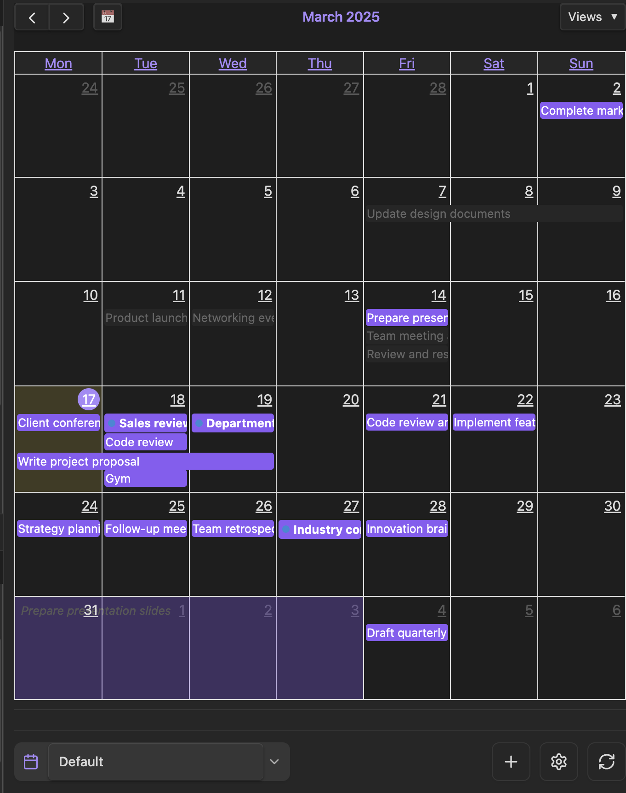
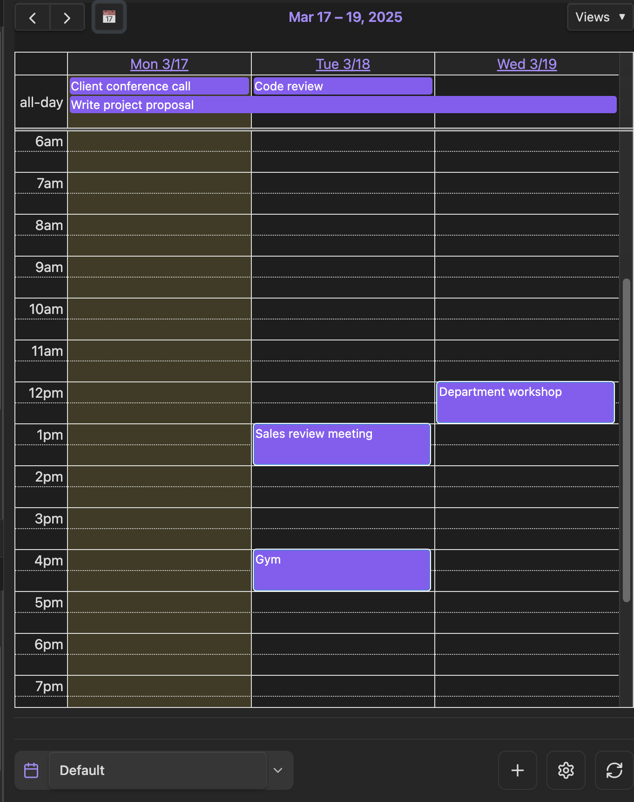
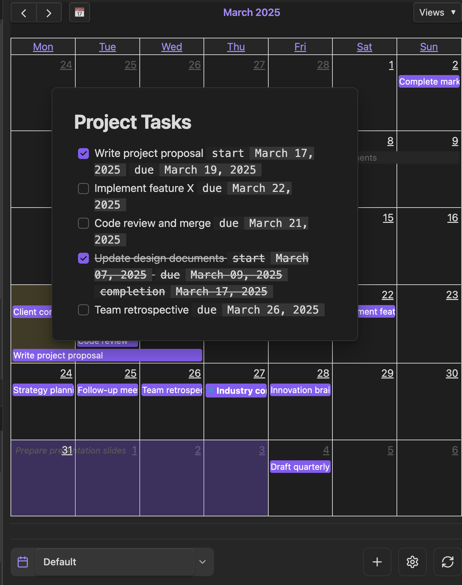
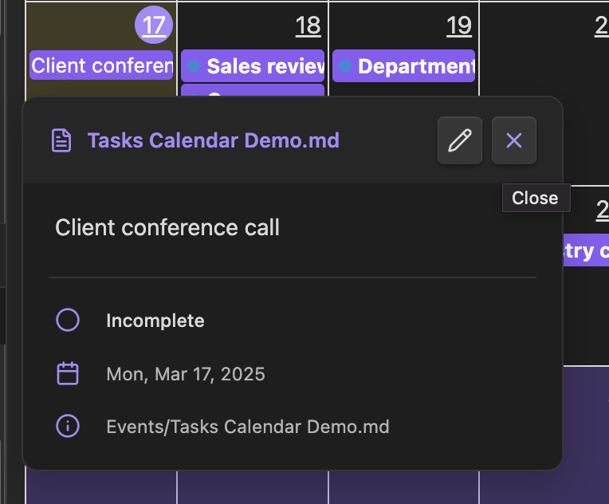
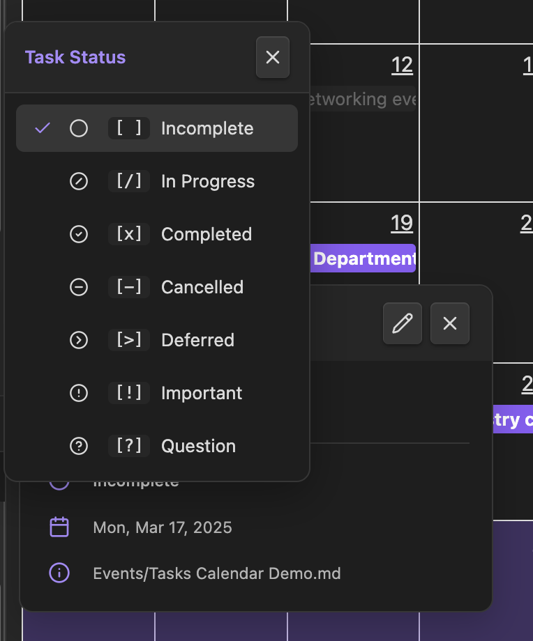
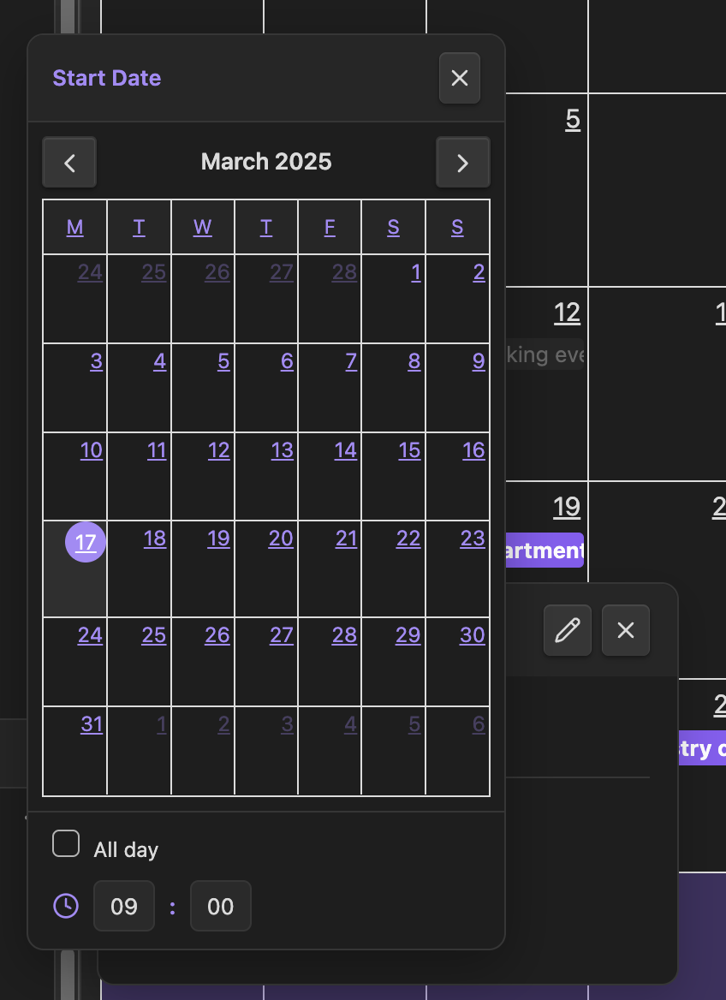

# Tasks Calendar

Tasks Calendar is an [Obsidian.md](https://obsidian.md/) plugin that leverages [FullCalendar](https://fullcalendar.io/) to visualize tasks on an interactive calendar. By integrating with the [Dataview](https://blacksmithgu.github.io/obsidian-dataview/) plugin, it automatically gathers tasks from your notes and presents them in a flexible, easy-to-manage interface.

## Supported Task Formats

- Supports tasks defined with basic dates:
  ```
  - [ ] Task description [due:: YYYY-MM-DD]
  ```
- Supports multi-day tasks:
  ```
  - [ ] Task description [start:: YYYY-MM-DD] [due:: YYYY-MM-DD]
  ```
- Supports tasks with specific date and time:
  ```
  - [ ] Task description [due:: YYYY-MM-DDTHH:mm]
  ```

That's it. You are free to write your tasks wherever you want.

## Features

- **Dynamic Task Aggregation**:
  Scans your vault for tasks regardless of location.
  - Customizable Dataview queries to filter target files
  - Filter tasks by status or tags
  - Supports multi-day tasks and events with specific times

- **Interactive Calendar Interface**:
  Offers multiple views: Month, Week, 3 Days, Day, and List.
  - Drag & drop to update task dates
  - Intuitive tooltips and popovers for quick task edits

- **Customization Options**:
  Configure calendar settings such as view type, first day of the week, and date properties.
  Manage multiple calendars with individual settings.

## Preview

### Calendar Views

<div align="center">
  <table>
    <tr>
      <td align="center">
        <br>
        <strong>Month View</strong><br>
        <small>Overview of all tasks for the month</small>
      </td>
      <td align="center">
        <br>
        <strong>3 Days View</strong><br>
        <small>Focused view of upcoming days</small>
      </td>
    </tr>
  </table>
</div>

### Task Management

<div align="center">
  <table>
    <tr>
      <td align="center">
        <br>
        <strong>Task Popover</strong><br>
        <small>Quickly edit task details</small>
      </td>
      <td align="center">
        <br>
        <strong>Task Tooltip</strong><br>
        <small>View task information at a glance</small>
      </td>
    </tr>
    <tr>
      <td align="center">
        <br>
        <strong>Status Picker</strong><br>
        <small>Update task status effortlessly</small>
      </td>
      <td align="center">
        <br>
        <strong>Date Time Picker</strong><br>
        <small>Set precise task schedules</small>
      </td>
    </tr>
  </table>
</div>

## Installation

1. Ensure the [Dataview](https://blacksmithgu.github.io/obsidian-dataview/) plugin is installed.
2. Run `npm install && npm run build` to generate the `main.js` file.
3. Copy `main.js`, `styles.css`, and `manifest.json` to:
   ```
   VaultFolder/.obsidian/plugins/tasks-calendar/
   ```
4. Enable the plugin via Obsidian’s settings.

## Usage

- **Opening the Calendar**
  Use the ribbon icon or the `Open Tasks Calendar` command. The calendar view opens automatically on startup after a brief delay.

- **Interacting with Tasks**
  Click a task to update its details, or drag & drop to adjust dates. The view refreshes automatically when tasks are updated in your vault.

## Related Plugins

### Comparison with obsidian-full-calendar

[obsidian-full-calendar](https://github.com/obsidian-community/obsidian-full-calendar) is a similar plugin that also uses the FullCalendar library. The key difference is in how tasks are managed:

|  | Tasks Calendar | obsidian-full-calendar |
|--|---------------|---------------|
| **Task Storage** | Tasks can be written anywhere in your vault | One note per task approach |
| **Task Discovery** | Uses Dataview to scan and aggregate tasks | Relies on dedicated note properties |
| **Philosophy** | Freedom to organize tasks in any note structure | Structured approach with dedicated notes |

### Compatibility with Tasks Plugin

Tasks Calendar works seamlessly with the [Tasks](https://github.com/obsidian-tasks-group/obsidian-tasks) plugin as both share similar philosophies for task management:

- Both allow tasks to be written anywhere in your vault
- Both scan your vault to gather and display tasks
- Use Tasks for powerful task filtering and management
- Use Tasks Calendar for visual calendar representation and simple task management

### Feature Parity Note

Tasks Calendar is not intended to be a direct replacement for obsidian-full-calendar.
Certain obsidian-full-calendar features (like Google Calendar integration) may or may not be added in the future.

## License

Distributed under the MIT License.

## Support

If you find this plugin useful and would like to support its development, you can donate via:

- [Ko-fi](https://ko-fi.com/aviatesk)
- [Buy Me A Coffee](https://www.buymeacoffee.com/aviatesk)

Your support helps maintain and improve Tasks Calendar! Thank you!🙏
